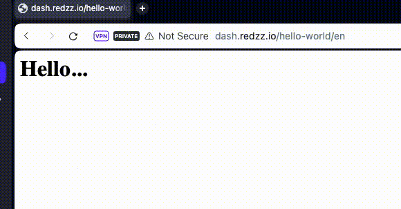
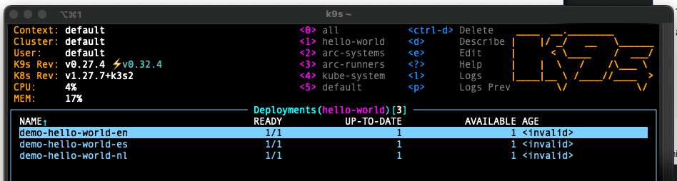

# Simple Hello World for K8s



## Basic Requirements

- Podman or Docker
- Helm
- kubernetes

## The Application

_Note: the command `podman` is interchangable with `docker`_

The app is found in the `app` folder. It contains the application files (`app.py`), the packages needed for the app to run (`requirements.txt`) and the file to build the container (`containerfile`).

To build and run the container run: `podman build -t hello -f app/containerfile && podman run -it -p 5000:5000 hello`

alternatively, for a spanish experience, you can run:

```
podman run -it -p 5000:5000 \
-e 'HELLO_VALUE=Hola' \
-e 'WORLD_VALUE=Mundo' \
hello
```

The image is available publicly in docker hub here too: `aleredzz/public:hello-world`

The application works in a way that the initial request from an user, creates a cookie in the user's browser. I went for this direction in favor of the user experience. Other options such as load balancing or just counting in the backend server wouldn't be enough if the backend restarts or the request is routed to another pod. User would not have a guartanteed response order.

## The Deployment

For the deployment part, We will need `helm` CLI tool and a Kubernetes cluster ready to interact with.
Go to the `helm` folder and edit the `values.yaml` file. In my case, my cluster nodes have already mapped the url `https://dash.redzz.io/` in my DNS.
The services and ingresses rules are created for each language added in the values file automatically.

```
cd helm
kubectl create ns hello-world
helm upgrade --install demo -n hello-world . -f values.yaml
```

To uninstall the application, run:

```
helm uninstall demo -n hello-world
kubectl delete ns hello-world
```


